# Solarteur Wissen ☀️ 👷

## 5 Sicherheitsregeln
Bei Arbeiten an elektrischen Anlagen sind die 5 + 5 Regeln (SUVA 84042.d) zwingend
anzuwenden. Für das spannungsfreie Arbeiten an einer Anlage gelten konsequent folgende fünf Sicherheitsregeln.
### 1. Freischalten
Freischalten aller Teile der Anlage, an denen gearbeitet
werden soll.
- LS-Schalter abschalten
- Schmelzsicherung entfernen
- Allpoliger Hauptschalter betätigen

### 2. Gegen Wiedereinschalten sichern
- Betätigungsmechanismus von Schaltgeräten durch
Schloss sichern
- Sicherungseinsätze mitnehmen
- Verbotsschilder anbringen

### 3. Spannungsfreiheit feststellen
- Spannungsfreiheit durch Fachkraft feststellen
- Überprüfung mit zweipoligem Spannungsprüfer

### 4. Erden und kurzschliessen
- Zuerst immer erden, dann mit den kurzzuschliessenden aktiven Teilen verbinden (muss von der Arbeitsstelle aus sichtbar sein)
- Diese Regel Nr. 4 entfällt bei Anlagen mit Spannung
< 1000 V (Ausnahme Freileitungen)

### 5. Benachbarte unter Spannung stehende Teile abdecken oder abschranken
- Anlagen < 1000 V
Abdecken mit isolierenden Tüchern, Schläuchen,
Formstücken, etc.
- Anlagen > 1000 V
Zusätzlich Absperrtafeln, Seile, Warntafeln, etc.
- Körperschutz
Schutzhelm mit Gesichtsschutz, eng anliegende
Kleidung, Handschuhe, etc.

# Stromverbrauch

Durchschnittlicher Verbrauch: Ein durchschnittlicher Schweizer Haushalt verbraucht etwa 5000 kWh pro Jahr ohne WP und E-Auto.

- Typischer Zwei-Personen-Haushalt:
    -In einem Mehrfamilienhaus: 2750 kWh/Jahr
    -In einem Einfamilienhaus: 3550 kWh/Jahr2

- Ein-Personen-Haushalt:
    -In einem Mehrfamilienhaus: 2200 kWh/Jahr
    -In einem Einfamilienhaus: 2700 kWh/Jahr2

- Vier-Personen-Haushalt:
    -In einem Mehrfamilienhaus: 3850 kWh/Jahr
    -In einem Einfamilienhaus: 5200 kWh/Jahr

[Stromverbrauch eines
typischen Haushalts Energie Schweiz](https://pubdb.bfe.admin.ch/de/publication/download/10559) 

Gesamtverbrauch Schweiz: 65 TWh = 10 hoch 12 W

Gesamterzeugung CH: 67 TWh

8% sind Erneuerbar

30% Atom

# Versorgungsnetz in der Schweiz

| Netzebene                    | Kraftwerke                           | Vebraucher            | Spannung                   |
| ---------------------------- | ------------------------------------ | --------------------- | -------------------------- |
| 1 Übertragungsnetz           | Pumpspeicher, Kernkraft, Wasserkraft | Schwerindustrie, SBB  | Höchstspannung 220/380 kV  |
| 2                            | Übertragungsnetz                     |                       |                            |
| 3 Überregionale Verteilnetze | Wasserkraft                          | Industrie             | Hochspannung 36 bis 220 kV |
| 4                            | Übertragungsnetz                     |                       |                            |
| 5 Regionale Verteilnetze     | Thermisch                            | Dienstleistungsbauten | Mittelspannung 1 bis 36 kV |
| 6                            | Übertragungsnetz                     |                       |                            |
| 7 lokale Verteilnetze        | Wind, Photovoltaik, Biogas           | Büros, Wohnen         | Niederspannung 400 / 230 V |

# Arbeit / Energie

Arbeit [Ws, J, Nm] $W = P * t$

Wärmemenge [J, Ws] $Q = m \cdot c \cdot \Delta T$

Mechanische Energie [Nm, kg*m2/s2] $ P = F * s = m * a * s = m * g *h$

Elektrische Arbeit [Ws] *Praxis [kWh]* $W = U * I * t * cos\phi$

Strahlungsenergie $Q$ [J, lms, lmh]

- 1 cal = 4.154 J
- 1 Ws = 1 J 
- 1 kWh = 3'600'000 J = 3.6 MJ
- 1 PS = 735 W 

Spezifische Wärmekapazität des Mediums [J/(kg·K)] $c$ / $c_{H2O}$ 4190 [J/(kg·K)]

Kraft [N] $F$ = $m$ * $a$

Beschleunigung [m/s2] $a$ / Erdanziehung $g$ = 9.81 [m/s2]

Zeit [s] $t$

Weg [m] $s$ / Höhe [m] $h$

Masse [kg] $m$ = $Q / (c*\Delta T  * \eta)$

Temperatur Grad Kelvin [K] $T$

1 kg ÖE = 41,868 MJ = 10'000 kcal = 11,63 kWh = 1.428 SKE

1 kg SKE = 0.7 kg ÖE = 7'000 kcal = 29'3076 MJ = 8,141 kWh

# Leistung 

Leistung [W] $P = W / t$

Leistung Gleichstrom / Scheinleistung [VA] / Omsche Last [W] $P = U * I = U2 / R = I²*R$

Leistung Wechselstrom Einphasig [W] $P = U * I * cos\phi$

Leistung Drehstrom Dreiphasig [W] $P = \sqrt{3} * U * I * cos\phi $

Leistungsfaktoktor $cos\phi = P /S$

*Gleichstrom: $cos\phi$ = 1*

Kosten = $W * Tarif$

Wirkungsgrad [Faktor] $\eta =  \frac{Nutzen}{Aufwand} = P_{ab} / P_{auf} = W_{ab} / W_{auf} = \eta_1*\eta_2*\eta_n $

Wandlungsverlust + $\eta$ = 100%

bsp: 0.92 * 0.93 * 0.8 = 0.684 --> 68%

1 - Verluste = Wirkungsgrad

Nutzenergie: E-Car Energie auf dem Rad 

Endenergie: Energie aus der Steckdose

## Der einfache Stromkreis ⚡

## Stromarten 🤘 AC/DC

🔋 Gleichstrom (Direct Curren) DC -

🔌 Wechselstrom (Alternating Current) AC ~

## Ohmsches Gesetz Ω

Spannung Volt [V] $U=R*I$

Stomstärke Ampère [A] $I=\frac{U}{R}$

Wiederstand Ohm [ $\Omega$ ] $R=\frac{U}{I}=(\rho*l)/A$

### Leiterberechnung

Leitung [m] = 2 * l

$\rho$ = spezifischer Wiederstand [ $\Omega$ mm²/m]

Leiter [m] $l$ = 2 x Leitungslänge

$A = r2 * \pi$ = Leiterquerschnitt [mm²]

Leitwert Siemens [S] $G = 1/R$

Spannungsabfall  [V] $\Delta U = U_{RL1} + U_{RL2} = (R_{L1}+R_{L2})*I=2*((\rho*l*I)/A)$

spezifischer Leitwiederstand zbsp für Kupfer $\rho_cu= 0.0175 \frac{\Omega * mm2}{m}$

Spezifische Leitfähigkeit $\gamma = 1 / \rho $

nach NIN max 4% zwischen HAK und Verbraucher (9.2V bei 230V)

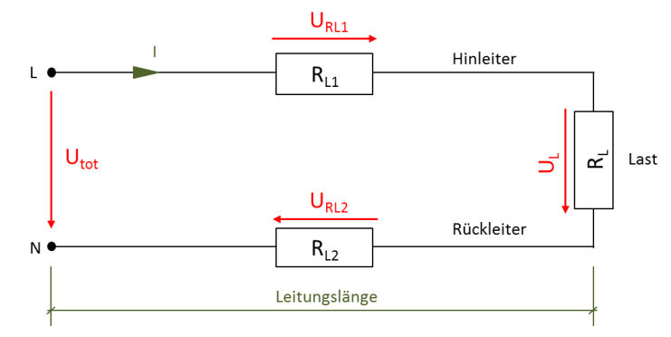

Leitungsverlust $P_v = U_v2 /R_l = I2 * R_l$

### Erlaubte Stromdichte für Leitungs Querschnitt

| Stromdurchfluss [A] | Querschnitt [mm²] |
| ------------------- | ----------------- |
| 200                 | 95                |
| 160                 | 70                |
| 100                 | 35                |
| 80                  | 25                |
| 69                  | 16 (Erdung)       |
| 50                  | 16 (Erdung)       |
| 40                  | 10                |
| 32                  | 8                 |
| 25                  | 6                 |
| 20                  | 4                 |
| 16                  | 2,5               |
| 16                  | 1.5               |

Die Erdung hat immer 16 mm² 

bsp: 16 A * 230 V = 3.68 kW

# Schmelzsicherungen

| Nennstrom          | Farbe      | Fußdurchmesser |       |         |
| ------------------ | ---------- | -------------- | ----- | ------- |
|                    |            | D              | DL    | D0      |
| 2 A                | 🟥 rosa    | 6 mm           | 8 mm  | 7,3 mm  |
| 4 A                | 🟫 braun   |                |       |         |
| 6 A                | 🟩 grün    |                |       |         |
| (10 A mit 6 A Fuß) | 🟥 rot     |                |       |         |
| 10 A               | 🟥 rot     | 8 mm           | 8 mm  | 8,5 mm  |
| (13 A)             | ⬛ schwarz  |                |       |         |
| 16 A               | ⬜ grau     | 10 mm          | 10 mm | 9,7 mm  |
| 20 A               | 🟦 blau    | 12 mm          | 12 mm | 10,9 mm |
| 25 A               | 🟨 gelb    | 14 mm          |       | 12,1 mm |
| 32 A               | 🟪 violett |                |       |         |
| 35 A (40 A)        | ⬛ schwarz  | 16 mm          |       | 13,3 mm |
| 50 A               | ⬜ weiß     | 18 mm          |       | 14,5 mm |
| 63 A               | 🟧 kupfer  | 20 mm          |       | 15,9 mm |
| 80 A               | ⚪ silber   |                |       | 21,4 mm |
| 100 A              | 🟥 rot     |                |       | 24,2 mm |

[Wikipedia Schmelzsicherungen](https://de.wikipedia.org/wiki/Schmelzsicherung)

### Beispiel

40 Ampère Sicherung * 230 V * 3 Phasen = 27600 VA -> 27,6 kWP max Leistung der Solaranlage 
$I * U * cos\phi= P$

### Serieschaltung

Alle Wiederstände sind vom selben Strom druchflossen:
$I_{tot} = I_2 = I_3 = I_3$

Die Spannung wird von den Wiederständen proportional geteilt:
$U_{tot} = U_1 + U_2 + U_3$

Die Widerstände werde addiert: 
$R_{tot} = R_1 + R_2 + R_3$

### Parallelschaltung

Der Strom fliesst proportional:
$I_{tot} = I_1 + I_2 + I_3$

Die Spannung ist an allen Wiederständen gleich:
$U_{tot} = U_1=U_2=U_3$

Der  Kehrwert des Gesammtwiederstand ist die Summe der Kehrwerte der Einzelwiederstände: 
$R_{tot} = 1 / (1/R_1 + 1/R_2 + 1/R_3) = R_{Einzel}/
n$

## Schutzmassnahmen in der Hausinstallation nach NIN

### Basisschutz 

Die maximale 
Berührungsspannung ist bei Gleichspannung 120 V (für Spielzeug, Kesselanlagen, Labor,
etc. 60 V) und bei Wechselspannung 50 V (für Spielzeug, Kesselanlagen, Labor, etc. 
25 V). Aktive Teile einer Installation mit höheren Spannungen müssen gegen zufällige 
Berührung geschützt sein. Dies kann mittels Abschrankungen oder Isolierung erreicht 
werden. 

### Fehlerschutz

Stromstärke Wirkung auf Personen
- 0.005mA Wahrnehmbarkeit mit der Zunge
- 1mA Reizschwelle Kribbeln, Gefühl wie eingeschlafene Hand
- 15mA Krampfschwelle Loslassgrenze, Muskelverkrampfungen
- 50mA Gefahrenschwelle Verkrampfungen Atemmuskulatur, Herzkammerflimmern
- 80mA Todesschwelle Herzkammerflimmern, Tod

Mechanismen für den Personenschutz in der elektrotechnischen Installation sollen bewir
ken, dass
- der Berührungsstrom durch den menschlichen Körper möglichst klein ist.
- die Berührungsspannung möglichst klein ist.
- der gefährliche Zustand möglichst kurz bestehen bleibt.

SELV Safety Extra Low Voltage Transformatoren
Keine Verbindung zum 
Schutzleiter. Die Ausgangsspannung bei Wechselspannung 
übersteigt 50 V nicht. Bei Gleichspannung liegt die Ausgangsspannung unter 120 V.

PELV
Protective Extra Low Voltage Transformator
Trennstelle, mit 
der die Ausgangsseite des Trafos 
vom Schutzleiter sicher getrennt 
werden kann.

FELV Transformator (Funktional Extra Low Voltage) gibt es keine 
Trennstelle, mit der die Ausgangsseite des Trafos vom Schutzleiter sicher getrennt werden kann. Die Ausgangsseite ist demnach immer mit Schutzleiter Anschluss.

### 1 Überlastschutz

Elektrotechnische Betriebsmittel wie Leitungen, Motoren, etc. müssen gegen Überlastung geschützt werden. Bei Überlast besteht die Gefahr einer Überhitzung und somit 
einem Brandfall. Schutzelemente für Überlast beinhalten einen elektrothermischen Auslösemechanismus (Bimetall). 

Schutzelemente → Schmelzsicherungen, LS Leitungsschutzschalter, Thermorelais

### 2 Kurzschlussschutz

Jeder Stromkreis muss so geschützt werden, dass im Kurzschlussfall die hohen Ströme 
schnell und gefahrlos abgeschaltet werden, um weitere Schäden zu vermeiden. Zu beachten ist, dass beim Schalten von hohen Strömen (in der Nähe von z.B. Transformatoren > 10 kA) Lichtbogen bestehen bleiben können und somit der Stromfluss nicht unterbrochen wird. Schutzelemente für Kurzschluss beinhalten einen elektromagnetischen 
Auslösemechanismus (Magnetspule).

Schutzelemente → Schmelzsicherungen, Leitungsschutzschalter, Leistungsschalter

### 3 Fehlerstromschutz

Gemäss den aktuellen Regeln der Technik (NIN) wird heute für viele Anlageteile (z.B. 
Beleuchtungen, Steckdosen, Baustelleninstallationen, etc.) ein Fehlerstromschutz verlangt. Fehlerströme sind Ströme, die infolge Defekts eines Betriebsmittels nicht auf dem 
vorgesehenen Strompfad (Neutralleiter) zur Spannungsquelle zurück fliessen.

Schutzelemente → Fehlerstromschutzschalter RCD (FI)

### 4 Störlichtbogen-Schutzeinrichtung

Für den erweiterten Brandschutz können Geräte eingesetzt werden, die Störlichtbögen 
(ausgelöst z.B. durch Wackelkontakte) erkennen und die betroffenen Stromkreise abschalten. Der Einsatz wird in kritischen Umgebungen empfohlen.

Schutzelemente → Brandschutzschalter AFDD

### 5 Selektivität

Tritt in elektrischen Anlagen ein Fehler auf, darf nur diejenige Schutzeinrichtung ansprechen, die der Fehlerquelle unmittelbar vorgeschaltet ist.

### Schutzklassen
Schutzklasse
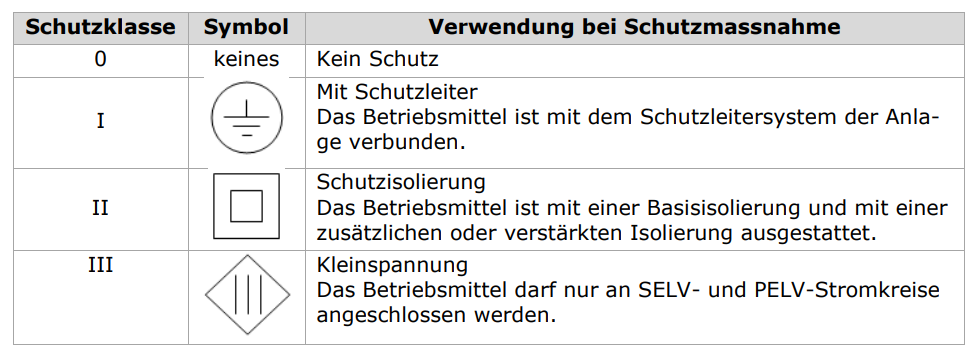

IP Schutzarten Bild
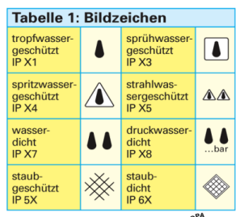

IP Schutzarten
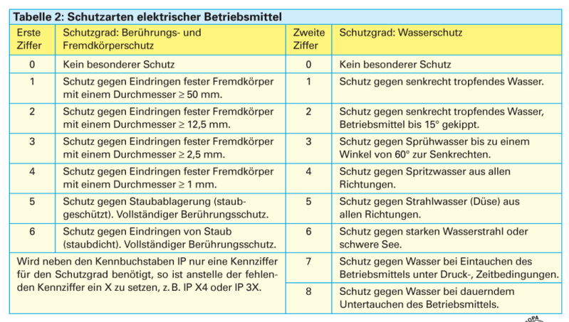

## Betriebsmittel für Schutzzwecke
### 1 Schmelzsicherungen
Eine Schmelzsicherung schützt die nachgeschaltete Leitung vor Überlast und Kurzschluss. Die Auslösung basiert auf der Stromwärme, die eine Sollbruchstelle innerhalb der Sicherung zum Schmelzen bringt. Als 
Funkenlöscher wird Quarzsand eingesetzt.

### 2 Leitungsschutzschalter
Ein Leitungsschutzschalter schützt die nachgeschaltete Leitung vor Überlast und Kurzschluss und können nach einer 
Auslösung wieder eingeschaltet werden. Sie besitzen einen 
thermischen und einen magnetischen Auslöser. Bei Überlastung erwärmt sich das Bimetall und löst den Leitungsschutzschalter aus. Bei hohen Kurzschlussströmen entklinkt der elektromagnetische Auslöser das Schaltschloss 
unverzögert. Der Schlaganker trennt das Schaltstück, ehe 
der Kurzschlussstrom seinen Höchstwert erreichen kann.
#### Typ B
- für Leitungsschutz bei Verbrauchern wie Heizung, 
Kochherd, Boiler, etc.
-- Unverzögerte Auslösung beim 3- bis 5-fachen Bemessungsstrom
#### Typ C
- für Leitungsschutz bei Verbrauchern, die grosse
Einschaltströme verursachen wie zum Beispiel Motoren, etc.
- Unverzögerte Auslösung beim 5- bis 10-fachen Bemessungsstrom
#### Typ D
- für Leitungsschutz bei Verbrauchern mit Schweranlauf
- Unverzögerte Auslösung beim 10- bis 20-fachen 
Bemessungsstrom

Energiebegrenzungsklasse und Schaltvermögen sind auf 
Leitungsschutzschaltern durch Bildzeichen angegeben. 
Leitungsschutzschalter der Energiebegrenzungsklasse 3 
haben die beste (kürzeste) Kurzschlussstrombegrenzung.

### 3 Fehlerstromschutzschalter FI
Der RCD (Residual Current protective Device) vergleicht 
die gleichzeitig in den Leitern L1, L2, L3 und N fliessenden Ströme. Fehlt in der Summe ein Teil des Stromes, 
weil er über den Schutzleiter (PE) oder die Erde fliesst, 
schaltet der RCD aus, sobald die Fehlerstromstärke den 
zulässigen Wert (steht auf dem RCD) überschreitet. 
Die Auslösung basiert auf dem elektromagnetischen 
Prinzip (Summenstrommessung).
Es gelten folgende max. Werte für die Fehlerstromstärke
- Personenschutz 30mA (10mA)
- Sachenschutz 300mA
### 4 Brandschutzschalter
Brandschutzschalter bieten Schutz vor seriellen und parallelen 
Fehlerlichtbögen. Dafür sorgt ein Mikroprozessor, der kontinuierlich viele Strom- und Spannungsparameter überwacht. Erkennt er 
charakteristische Strom- und Spannungsverläufe, die auf einen 
Fehlerlichtbogen hindeuten, schaltet er den Stromkreis ab.

## Sicherheit bei Arbeiten an elektrischen Anlagen
### 1. Warum Arbeitssicherheit?
Jeder schwere Unfall, jede arbeitsbedingte Krankheit ist eine menschliche Belastung.
Zusätzlich entstehen auch Probleme im Betrieb

- Der verunfallte oder erkrankte Mitarbeiter fehlt auf der Baustelle
- Es kommt zu Engpässen, Terminproblemen, Stress
- Die Kunden ärgern sich über Terminverschiebungen
- Es kommt vielleicht gar zum Verlust von Aufträgen.

**Jeder Abwesenheitstag kostet das Unternehmen 600 bis 1000 Franken.**

Mit dem Aufbau eines betrieblichen Sicherheitssystems engagieren sich die Betriebe für
sichere und gesunde Arbeitsplätze. Sie können damit

- Menschliches Leid verhindern
- Die direkten und indirekten Unfallkosten wie Ausfallstunden, administrative
- Umtriebe usw. reduzieren
- Steigende Versicherungsprämien vermeiden
- Die gesetzlichen Verpflichtungen gegenüber Ihren Mitarbeitenden nachhaltig er-
füllen
- Ihre Mitarbeitenden zu sicherem und gesundheitsbewusstem Verhalten motivie-
ren und ausbilden
- Eine lebendige Sicherheitskultur im Unternehmen schaffen
- Haftpflichtansprüche oder gar strafrechtliche Folgen vermeiden
- Konkurrenzfähig bleiben

## Gesetzliche Grundlagen

Die Schweizer Gesetzgebung verpflichtet Unternehmen zu einer aktiven Rolle in der Un-
fallverhütung. Für die Sicherheit und den Gesundheitsschutz der Arbeitnehmerinnen und
Arbeitnehmer sind insbesondere folgende Gesetze (zusammen mit den dazugehörigen
Ausführungsbestimmungen) von Bedeutung am Arbeitsplatz und in der Freizeit.
- Unfallversicherungsgesetz (UVG) -> Unfallversicherung, Arbeitssicherheit, Nichtbetriebsunfall
- Arbeitsgesetz (ArG) -> Arbeits- und Ruhezeiten, Sonderschutz für Frauen und Jugendliche, Gesundheitschutz, Plangenehmigung
- Bundesgesetz über die Sicherheit von Produkten (PrSG) ->Inverkehrbringen von gewerblichen und beruflichen Produkten, Gewährleistung der Sicherheit von Produkten, Erleichterung des grenzüberschreitenden freien Warenverkehrs

## EKAS
In seiner Botschaft zum UVG hat der Bundesrat die Eidge-
nössische Koordinationskommission für Arbeitssi-
cherheit EKAS als zentrale Informations- und Koordinati-
onsstelle für Sicherheit und Gesundheitsschutz am Arbeits-
platz definiert. Sie koordiniert die Präventionsmassnah-
men, die Aufgabenbereiche im Vollzug und die einheitliche
Anwendung der Vorschriften. Ihre Beschlüsse sind verbindlich.
Für die Aufsicht über die Umsetzung der Vorschriften im Bereich Arbeitssicherheit – aber
auch für die wichtige Beratung der Betriebe – sind so genannte «Durchführungsorga-
ne» zuständig.
In erster Linie sind die Kantone und die Suva mit der Beratung und Überwachung der
Betriebe beauftragt. Die Suva führt hierfür ein eigenes Departement «Gesundheits-
schutz». In zweiter Linie wirken das SECO und Fachorganisationen bei der Durchfüh-
rung mit.

## Massnahmen zur Verhütung von Unfällen

### 1 Technische Massnahmen
Die technischen Massnahmen decken Installation, Be-
trieb und Instandhaltung von Anlageteilen und Be-
triebsmitteln ab.
- Montagehinweise / -vorschriften für die Erstel-
lung von elektrischen Installationen
- Einsatz von mechanischen Schutzvorrichtungen
bei Maschinen, Produktionsanlagen, etc.
- Sofortige Reparatur von defekten Betriebsmitteln

### 2 Organisatorische Massnahmen
Die organisatorischen Massnahmen sorgen für die rich-
tige Schulung und Anwendung von entsprechenden Vor-
schriften und Materialeinsätzen.
- Anwendung der aktuellen Gesetze und Verord-
nungen
- Installationen nach den aktuellen „Regeln der
Technik“ (Installationsvorschriften)
- Einsatz von Material mit entsprechenden Sicher-
heitszeichen

### 3 Persönliche Massnahmen
- Vorsichtiges und konzentriertes Arbeiten ohne
Einfluss von Drogen jeglicher Art
- Instandhaltung der persönlichen Schutzausrüs-
tung
- Richtiger Umgang mit Leitern

## Unfallgefahren bei Arbeiten an elektrischen Anlagen

|GefahrenFolgen | Beispiele|
|---------------|----------|
|Durchströmung|Der Strom fliesst durch den menschlichen Körper. Folgen davon sind Innere Verbrennungen mit z.T. Langzeitschäden|
|Lichtbogen|Der Strom tritt via Funkenbogen in den menschlichen Körper ein und / oder aus. Folgen davon sind Gefährdung der Augen , Verbrennungen an Ein- / Austrittsstelle |
|Abschmelzende Materialien |  - Verbrennungen durch heisses (abgesprengtes) Material, Gefährdung der Augen|
|Brand| Die Stromwärme entzündet Materialien, Funken entzünden explosionsartig Staub. -> Verbrennungen Vergiftungen|
|Sekundärunfälle| Sturz von Leiter, Sturz von Baugerüst, Reflexbedingte Rückzugbewegungen Schnitte an Finger, Hand, Arm|

Informative Web-Links (Quellenangaben)
http://www.ekas.chhttp://www.electrosuisse.ch
http://www.asa-inside.chhttp://www.esti.ch
http://www.batisec.chhttp://www.vsei.ch
http://www.suva.ch

## Gesetzliche Grundlagen
Gesetzespyramide

Europa- und auch weltweit gibt es Bestrebungen, technische Normen und Regelungen zu
vereinheitlichen. Dies hat zur Folge, dass Handelshemmnisse beseitigt werden und be-
stehende Schranken im Warenverkehr fallen. Im Bereich der Elektrotechnik nehmen
folgende Institutionen diese Harmonisierungsaufgaben wahr

### International 

IEC International Electrotechnical Commission

### Europa 

CENELEC Comité Européen de Normalisation Électrotechnique

ETSI European Telecommunications Standards Institute

### National

CES Comité Electrotechnique Suisse

SICTA Swiss Information and Communications Technology Association

Die in der Schweiz vorhandenen technischen Normenwerke (Regeln der Technik) basie-
ren auf unseren geltenden Gesetzen und Verordnungen.
Achtung → es sind immer die neusten Ausgaben zu berücksichtigen.
### Basis
SR 101
Bundesverfassung der Schweizerischen
Eidgenossenschaft vom 18. April 1999
### Gesetze
SR 734.0
Bundesgesetz vom 24. Juni 1902 betref-
fend die elektrischen Schwach- und Stark-
stromanlagen (Elektrizitätsgesetz, EleG)

SR 930.11
Bundesgesetz vom 12. Juni 2009 über die
Produktesicherheit (PrSG)

SR 832.20
Bundesgesetz vom 20. März 1981 über die
Unfallversicherung (UVG)

SR 734.7
Bundesgesetz vom 23. März 2007 über die
Stromversorgung (Stromversorgungsge-
setz, StromVG)
### Verordnungen
SR 734.2
Verordnung vom 30. März 1994 über elektrische Starkstromanlagen (Starkstromverord-
nung)

SR 734.27
Verordnung vom 7. November 2001 über elektrische Niederspannungsinstallationen
(Niederspannungs-Installationsverordnung, NIV)

SR 734.26
Verordnung vom 9. April 1997 über elektrische Niederspannungserzeugnisse (NEV)

SR 734.31
Verordnung vom 30. März 1994 über elektrische Leitungen (Leitungsverordnung, LeV)

SR 734.24
Verordnung vom 7. Dezember 1992 über das Eidgenössische Starkstrominspektorat

SR 734.5
Verordnung vom 18. November 2009 über die elektromagnetische Verträglichkeit
(VEMV)

SR 734.71
Stromversorgungsverordnung vom 14. März 2008 (StromVV)

SR930.111
Verordnung vom 19. Mai 2010 über die Produktesicherheit (PrSV)

SR 832.202
Verordnung vom 20. Dezember 1982 über die Unfallversicherung (UVV)

## Regeln der Technik
 
### NIN Niederspannungs-Installationsnorm 2020

### Niederspannungs-Installationsverordnung NIV
regelt die Voraussetzungen für das Arbeiten an elektrischen Niederspannungsinstallationen (elektrische Installationen) und
die Kontrolle dieser Installationen.

In der NIV sind definiert
- Allgemeine Bestimmungen und Anforderungen an die Sicherheit von elektrischen
Installationen
- Welche Bedingungen erfüllt sein müssen, um vom Eidgenössischen Starkstromin-
spektorat ESTI eine Bewilligung für die Installationen von elektrischen Anlagen im
- Niederspannungsbereich zu erhalten.
Grundsätze für die Ausführung von elektrischen Installationen.
- Welche Bedingungen erfüllt sein müssen, um vom Eidgenössischen Starkstromin-
spektorat ESTI eine Bewilligung für die Kontrolle von elektrischen Anlagen im Nieder-
spannungsbereich zu erhalten.
- Ebenfalls ist die Periodizität der Kontrolle von elektrischen Anlagen in einem Anhang
der NIV angegeben.

Die NIV SR 734.27 ist seit 1. Januar 2002 in Kraft (aktueller Stand 1. Juni 2019).

#### Regeln der Technik
Als Regeln der Technik gelten für Elektroinstallationen im Niederspannungsbereich die
Niederspannungs-Installationsnorm NIN 2020. Diese ist in gekürzter Fassung mit den
wesentlichen Normen und Richtlinien in der NIN-Compact (NIN-C) zusammengefasst.
Beide Regelwerke werden von der electrosuisse erstellt und herausgegeben.
In der NIN / NIN-C sind harmonisierte Normen nach IEC und CENELEC und die ergän-
zenden schweizerischen Regeln wiedergegeben.
NIN und NIN-C basieren auf der Niederspannungs-Installationsverordnung NIV (Art. 3
Grundlegende Anforderungen an die Sicherheit), die besagt, dass
elektrische Installationen nach den anerkannten Regeln der Technik erstellt, geän-
dert, in Stand gehalten und kontrolliert werden müssen. Sie dürfen bei bestim-
mungsgemässem und möglichst auch bei voraussehbarem unsachgemässem Betrieboder Gebrauch sowie in voraussehbaren Störungsfällen weder Personen noch Sachen
gefährden.
als anerkannte Regeln der Technik insbesondere die Normen von IEC und CENELEC
gelten. Wo international harmonisierte Normen fehlen, gelten die schweizerischen
Normen.
Bei Nichtbestehen von spezifischen technischen Normen sinngemäss anwendbare
Normen oder allfällige technische Weisungen zu berücksichtigen sind.

#### Erstprüfung von elektrischen Installationen
Bei neuerstellten elektrischen Installationen muss vor Inbetriebnahme ein Erstprüfung
durchgeführt werden. Diese umfasst eine Sichtprüfung und verschiedene Messungen und
Funktionskontrollen gemäss einer definierten Kriterienliste (NIN-C 2020 / Normenteil 6).

#### Sicherheitsnachweis von elektrischen Installationen

Gemäss Niederspannungs-Installationsverordnung NIV (Art. 35 – 38) muss die Sicherheit von elektrischen Installationen nachgewiesen werden. Als sicher können Anlagen
eingestuft werden, die nach den anerkannten Regeln der Technik (NIN / NIN-C) instal-
liert worden sind und bei denen keine Fehlerzustände vorliegen. Sicherheitsnachweise
(SiNa) müssen erstellt werden bei
Neuinstallationen, Ergänzungen und Erweiterungen von elektrischen Anlagen
Periodisch gemäss Anhang zur NIV SR 734.27.
Gemäss NIV Art. 37 (Anforderungen an den Sicherheitsnachweis) muss der Sicherheits-
nachweis mindestens folgende Angaben enthalten
Adresse der Installation und des Eigentümers
Beschreibung der Installation einschliesslich allfälliger Besonderheiten
Kontrollperiode
Name und Adresse des Installateurs
Ergebnisse der betriebsinternen Schlusskontrolle
Name und Adresse des Inhabers der Kontrollbewilligung und Ergebnis seiner Kontrolle bei Abnahmekontrollen nach Artikel 35 Absatz 3 und periodischen Kontrollen nach
Artikel 36.
Der Sicherheitsnachweis muss von der Person, welche die Kontrolle durchgeführt hat,
und vom Inhaber der Installationsbewilligung sowie gegebenenfalls vom Inhaber der
Kontrollbewilligung, unterzeichnet werden.

# Solarzelle 

Die kristalline Silizium-Solarzelle setzt sich aus zwei unterschiedlich dotierten Silizium-Schichten zusammen.

Die dem Sonnenlicht zugewandte Schicht ist mit Phosphor negativ dotiert, die darunterliegende Schicht ist mit Bor positiv dotiert. An der Grenzschicht entsteht ein elektrisches Feld, dass zur Trennung der durch das Sonnenlicht freigesetzten Ladungen (Elektronen und Löcher) führt. 

p-Schicht (positiver Bereich): Wird durch Bor-Dotierung erzeugt. Bor hat drei Valenzelektronen, wodurch Elektronenlöcher (positive Ladungsträger) entstehen.

n-Schicht (negativer Bereich): Wird mit Phosphor dotiert, das fünf Valenzelektronen hat, wodurch freie Elektronen (negative Ladungsträger) entstehen.

Auf der Rückseite ist das Anbringen einer ganzflächigen Kontaktschicht durch Aluminium- oder Silberpaste möglich. Die Vorderseite muss hingegen möglichst lichtdurchlässig sein. Hier werden die Kontakte meist in Form eines dünnen Gitters oder einer Baumstruktur aufgebracht. Durch Abschneiden oder Aufdampfen einer dünnen Schicht (Antireflexschicht) aus Siliziumnitrid oder Titandioxid auf der Vorderseite der Solarzelle lässt sich die Lichtreflexion verringern.

Eine aktuelle Standard-Solarzelle aus kristallinem Silizium liefert eine Leerlaufspannung (UOC) von 0.60 bis 0.70V und einen Kurzschlussstrom (ISC) von 10 bis 11A. Hierbei handelt es sich um Gleichstrom.

### Klassifizierung der Zellen
- kristallinen Siliziumzellen (die als ca. 200 Mikrometer dicke Wafer im Modul miteinander verlötet werden) Palykristalin und Monokristalin
- Dünnschichtzellen (bei denen eine minimal dicke Zellschicht auf die Frontglasfolie aufgedampft / aufgedruckt wird) 
- nano-strukturierten Zellen (bei denen nanometerkleine Zellen gebildet und miteinander verschalten werden)

## Solar Panel Auslegung

1000 W/m2 Globalstrahlung (Gh oder GHI) im Mittelland, davon bei AM 1.5 max 835 W/m2 direkte Strahlung (Bn oder DNI) der rRst divuse Strahlung (Dh oder GHI)
bis 1500 w/m2 im Hochgebirge

https://everywhere.solar/
https://solargis.com/resources/free-maps-and-gis-data

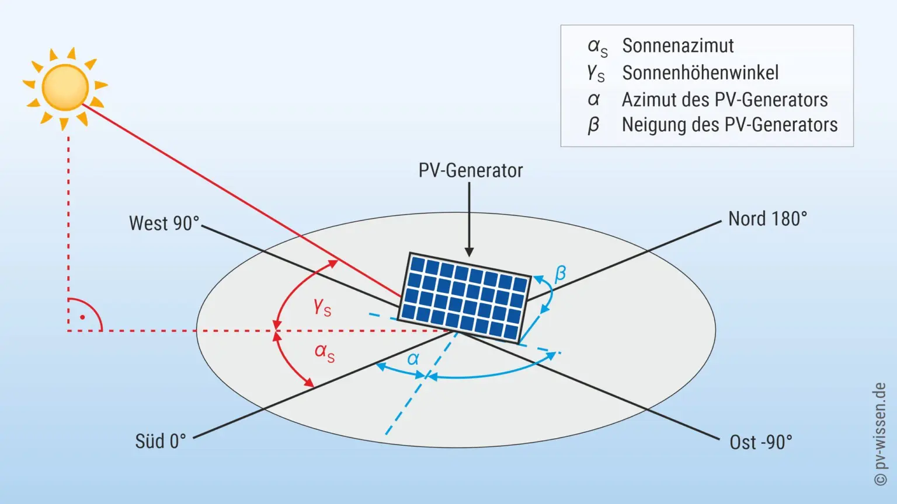

Die folgende Abbildung zeigt den Jahresertrag im Verhältnis zur optimalen Ausrichtung – in der Schweiz ca. 35°S.

Etragsoptimierte Ausrichtung nach Süden 15° - 30°.
Eigenverbrauchsoptimierung Ost-West 10° - 20°

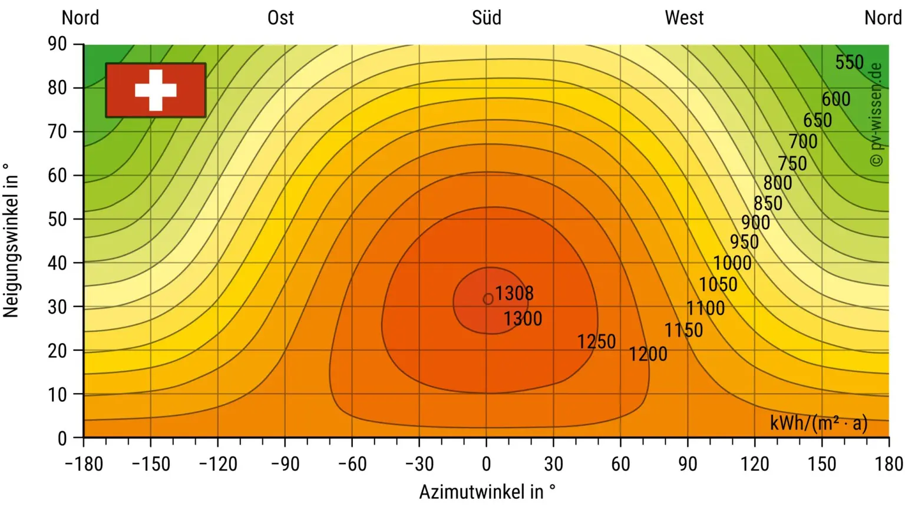

### Reihenabstand

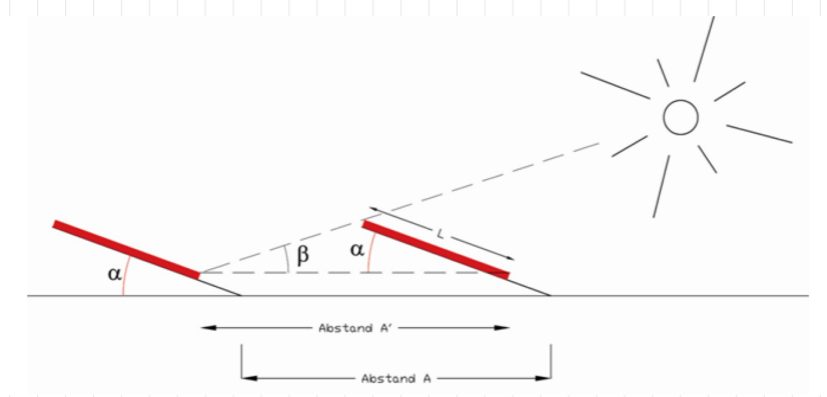

$R=(sin\alpha/tan\beta + cos \alpha)*L$

tiefster Sonnenstand 21 Dezember keine gegenseitige Verschattung

## Auslegung Wechselrichter

### Wechselrichterarten

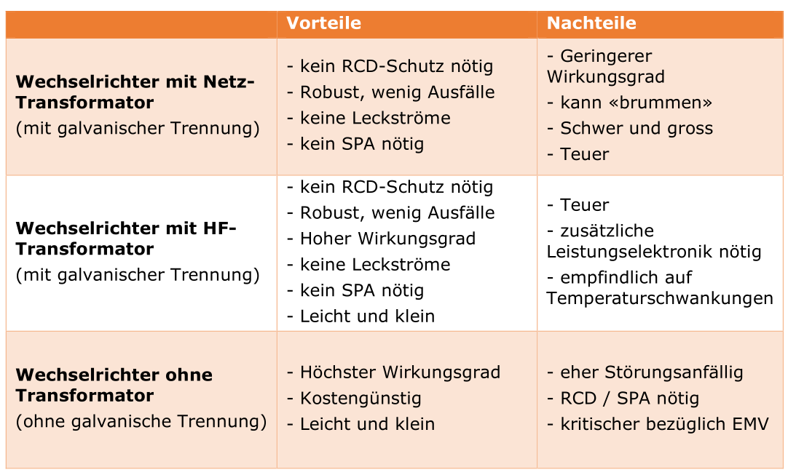

### Wechselrichtertypen

#### Modulwechselrichter
- Einsatz meist bei Kleinstanlagen (Balkonmodule /
Tisch)
- Nur einphasig erhältlich (max. Unsymmetrie 3.6kVA)
- Kommunikation über PLC (Power Line Communication)
- Module sind Parallel- statt Serie, keine hohe DC-Spg.
- MPP-Tracking auf Modulebene
- Abschaltung der Anlage bis Modulebene möglich
- Viel elektronische Geräte, erhöht Serviceaufwand
- Relativ teuer, nicht weit verbreitet

#### Strangwechselrichter
- Einsatz bei kleinen Photovoltaik-Anlagen
- Wechselrichter verfügt über nur einen MPP-Tracker
- Ein- oder dreiphasig erhältlich
- Meist ohne galvanische Trennung
- Wenn galvanische Trennung, dann oft mit HF-Trafo
- Früher am weitesten verbreitet

#### Multistrangwechselrichter
- Einsatz bei mittleren bis grossen Photovoltaik-Anlagen
- Wechselrichter verfügt über mehrere MPP-Tracker
- Ein- oder dreiphasig erhältlich
- Meist ohne galvanische Trennung
- Wenn galvanische Trennung, dann oft mit HF-Trafo
- Ideal für eine Ost-West-Anlage
- Aktuell am weitesten verbreitet

#### Strangwechselrichter mit Leistungsoptimierer
- Einsatz bei kleinen bis grossen Photovoltaik-Anlagen
- Wechselrichter verfügt über keinen MPP-Tracker
- MPP-Tracking erfolgt auf Modulebene (Optimizer)
- Abschaltung der Anlage bis Modulebene möglich
- Ein- oder dreiphasig erhältlich
- Meist ohne galvanische Trennung
- Kommunikation über PLC (Power Line Communication)
- Ideal für verschatete Anlagen
- Viel elektronische Geräte, erhöht Serviceaufwand

#### Zentralwechselrichter
- Einsatz bei grossen Photovoltaik-Anlagen
- Wechselrichter verfügt über mehrere MPP-Tracker
- Oft in Kombination mit DC-Sammelkästen
- Geringe Netzrückwirkungen
- Meist direkt MS-Einspeisung über eigenen Trafo
- Master-Slave- oder Team-Konzepte möglich
- Wartung meistens über den Hersteller
- Hohe Zuverlässigkeit / meist hohe Kosten

## Grundkriterien Auslegung

1. Gesamt Leerlaufspannung Generator / Solar Module $UOC_{Module tot}$ **<** Maximal Spannung Wechselrichter $UWR_{max} bzw Eingang$

2. Maximale MPP-Spannung Generator / Solar Module $UMPP_{Module tot}$ **<** Maximal MPP Spannung Wechselrichter $UWRMPP_{max}$

3. Minimale MPP-Spannung Generator / Solar Modul $UMPP_{Module tot}$ **>** Minimale MPP Spannung Wechselrichter $UWRMPP_{min}$ / Startpannung

4. Maximale Kurzschlussstrom Generator / Solar Modul ISC **<** Maximialer Eingangsstrom $IWR_{max}$

- Kurzschlussstrom ISC (short circuit)
- Leerlaufsspannung UOC (open circuit)
- Maximale Leistung PMPP (maximum power point)
- Betriebsstrom IMPP
- Betriebsspannung UMPP
- Füllfaktor FF
- Wirkungsgrad 𝜂𝜂
- $cos \phi$ induktiv + / kapazitiv -
- Q (U) $cos \phi$ der Spannung Nachführend
- Nennleistung maximal bei $cos \phi$ 1 gleich Scheinleistung (VA)
- Netznennspannung 1 * 230 V / 3* 400 V
- Netzfrequenz 50 HZ für Europa
- Anzahl MPP Tracker
- Höhehnlage Gebäude

## maximale Leerlaufspannung

$UOC_{max}=UOC_{Modul STC}*(1+(T_{min}-T_{STC})*(kT_{UOC}/100))*n=UOC_{Modul}*kT_{NIN}*n$

### Variante 1:
Man berechnet die maximale Leerlaufspannung mithilfe des Temperaturkoeffizienten des Photovoltaikmoduls unter Berücksichtigung der minimalen Temperatur am Anlageort.
Der Temperaturkoeffizient $kt_{UOC}$ kann auf dem Datenblatt des Modulherstellers abgelesen werden, idR bewegt er sich bei kristallinen Modulen um - 0.32 %/°K.
Die minimale Temperatur ist seit der neusten NIN 2020 normativ vorgegeben:
- Anlagestandort < 800m.ü.M, Neigung < 15° **0°C**
- Anlagestandort < 800m.ü.M, Neigung > 15° **-5°C**
- Anlagestandort > 800 bis 1’500m.ü.M **-15°C**
- Anlagestandort > 1’500m.ü.M **-25°C**

### Variante 2:
Man berechnet die maximale Leerlaufspannung mithilfe des normativen Korrekturfaktors in Abhängigkeit der Höhe des Anlagestandortes.
Die NIN 2020 gibt auch hier normative Vorgaben für diesen Korrekturfaktor $KT_ {NIN}$:
- Anlagestandort < 800 m.ü.M Faktor **1.15**
- Anlagestandort > 800 bis 1’5000m.ü.M Faktor **1.20**
- Anlagestandort > 1'500 m.ü.M Faktor **1.25**

### maximale MPP-Spannung: 

$UMPP_{max}=UMPP_{Modul STC}*(1+(T_{min}-T_{STC})*(kT_{UOC}/100))*n$

### minimale MPP-Spannung:

$UMPP_{min}=UMPP_{Modul STC}*(1+(T_{max}-T_{STC})*(kT_{UOC}/100))*n$

### maximaler Kurzschlussstrom

$ISC_{max}=ISC_{Modul STC}*(1+(T_{max}-T_{STC})*(kT_{ISC}/100))*n$

Der Temperaturkoeffizient kann auf dem Datenblatt des Modulherstellers abgelesen werden, in der Regel bewegt er sich bei kristallinen Modulen um 0.03 % / °K. Da dieser Einfluss sehr klein ist, kann und wird die Temperaturkorrektur oft vernachlässigt.

NIN Faktor **1.25**

### MPP Fenster

Ist der MPP des Photovoltaikgenerators innerhalb des MPP-Fensters arbeitet der Wechselrichter im optimalen Betriebspunkt.

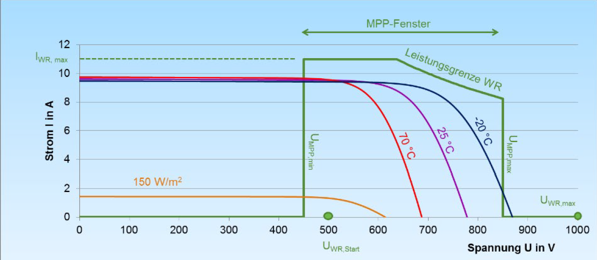

Ist die Strang- (String-) Spannung zu tief, kann der Wechselrichter den Generator nicht im MPP betreiben.
Die Ursachen hierfür können sein:
- Zu lange Kabel (Spannungsfall)
- Zu hohe Temperaturen
- Zu kurze Stränge / Strings

Ist die Strang- (String-) Spannung zu hoch besteht die Gefahr einer Überspannung. Diese Situation ist gefährlich und muss unter allen Umständen verhindert werden.
Die Ursachen hierfür können sein:
- Zu tiefe Temperaturen
- Zu lange Stränge / Strings

Ist der Strang- (String-) Strom oder die Leistung zu hoch, wird diese vom Wechselrichter abgeregelt.
Nicht alle Hersteller kommunizieren jedoch eine klare Grenze.
Die Ursachen hierfür können sein:
- Zu viele parallele Stränge / Strings
- Zu hohe Einstrahlung
- Falsche Überdimensionierung

## Strangsicherung

#### Maximaler Strom:
$I_{max} = I_{SC Modul} * 1.25$

#### Maximaler Rückstrom:
$I_{Rück} = I{SC Modul} * 1.25 * (n-1)$

#### Maximale Sicherungsgrösse IN
$1.5 * ISC < IN < 2.4 * ISC$

#### Strangsicherung Spannungsfestigkeit
$U_{Sicherung} > 1.2 * UOC_{Strang}$

Strangs- Stringsicherung notwendig wenn $I_{Rück} $ grösser als die zulässige Rückstrombelastbarkeit der Module.

Weil der Kurzschlussstrom ISC und der Betriebsstrom IMPP eines Photovoltaikmoduls sehr nahe beieinanderliegen, lässt sich die Schutzmassnahme «Schutz durch automatische Abschaltung» nicht so einfach realisieren, wie dies in der üblichen AC-Hausinstallation möglich ist.
Ein Photovoltaikmodul muss aber nicht grundsätzlich geschützt werden, denn es kann beliebig lange im Kurzschluss betrieben werden, ohne einen Schaden davon zu tragen.
Erst wenn mehrere Stränge / Strings parallel geschaltet werden besteht die reelle Gefahr, dass der nun vorhandene Kurzschlussstrom in einem Strang zu einer mechanischen Beschädigung der Photovoltaikmodule beiträgt. Davor muss ein Strang / String mittels Strangsicherungen geschützt werden (früher wurde diese Funktion von zusätzlichen Dioden übernommen).
Bei parallel geschalteten Strängen / Strings gibt es nun zwei zulässige Optionen:
1. Alle Betriebsmittel im Strang / String werden auf den maximal vorhandenen Strom dimensioniert
2. Es kommen Stringsicherungen zum Einsatz, sobald der Strom grösser ist als die Rückstrombelastbarkeit.

Die folgenden Fehler könnten unter anderem zur Reduzierung der offenen Klemmenspannung eines Strangs und damit zu einem Rückstrom bei Parallelschaltung führen:
- Kurzschluss eines oder mehrerer Module,
- Kurzschluss einer oder mehrerer Zellen im Modul,
- doppelter Erdschluss eines Moduls bzw. der Verkabelung.

# Blitzschutz / Überstromschutz

LPS Lightnig Protection System

Bei bestehendem Blitzschutz muss die PVA an diesen angebunden werden, auf kürzestem 
Weg und nicht quer (Beschädigung durch Dachlawine!)

Prinzip des Faraday Käfigs

Definiert in den Niederspannungs Installations Normen NIN

|Blitzschutz  Klassen |Maschenweite | Radius Blitzkugel | Abstand Ableitung | Gebäude|
|---------------------|-------------|-------------------|-------------------|--------|
| 1                   | 5 x 5m      | 20                | 10     | Rechencenter, Explosionsgefärdetet Gebäude|
| 2                   | 10 x 10 m   | 30                | 10     | Gebäude mit über 300 Personen, hohe Gebäude, Spitaler, Museen, Altersheime, mehr als 20 Pers. die auf fremde Hilfe angewiesen sind, Fermenter|
| 3                   | 15 x 15 m   | 45                | 20     | Hotels, Grosse  Gebäude mit Werkstatt und Staub, Pensionen mehr als 20 Pers die nicht auf fremde Hilfe angewiesen sind |

Objekte Grösser als 2 m2 müssen an Blitzschutz angebunden sein

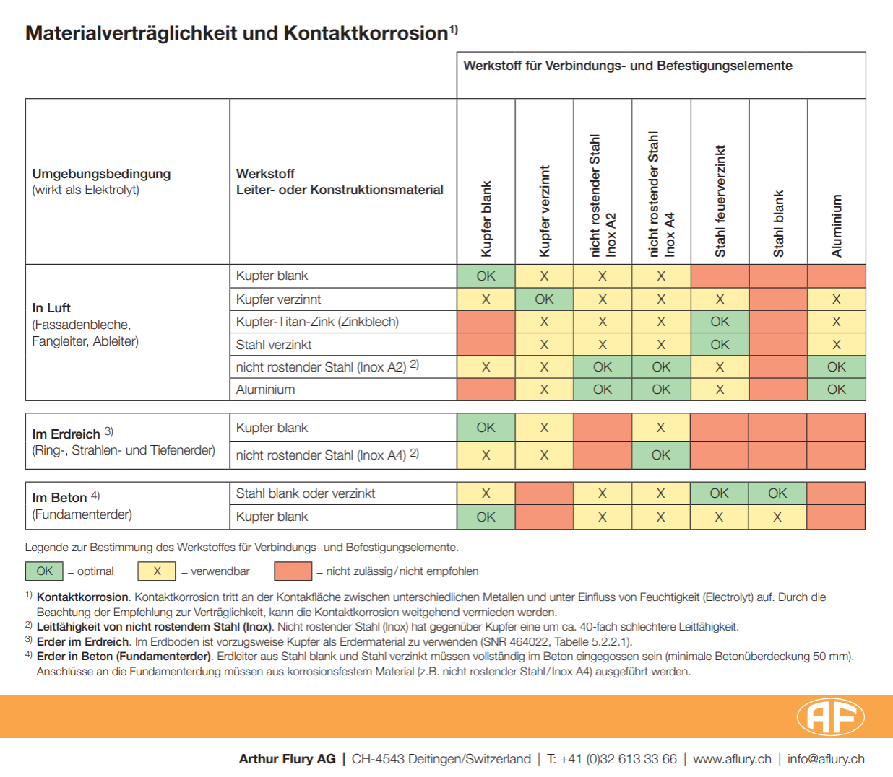

Blitzschutz Leitungen nie Parallel der Traufe
Alle 1 m befestigt

## Ueberstromschutz SPD

Ueberstromschutz bei Gebäudeintritt HAK (AC) GAK (DC) max 30 m von Eintritt
Verbindung zur Erdung via Pot

**Typ 1 Blitzschutz** Potentialausgleich Cu 16 mm2 Restpannung $U_{rest}$ 4kV 

**Typ 2** Potentialausgleich Cu 10 mm2 Geräteschutz $U_{rest}$ 2.5 kV 

**Typ 3 Gerätefeinschutz $U_{rest}$ 1.5 kV** Server etc.

Geschütze und ungeschützte DC Leitungen sind räumlich zu trennen, mindestens 
mit Trennsteg im Kabelkanal

- Blitzeinschläge
- Industrielle Überspannungen
- ESD (Elektrostatische Entladungen)
- NEMP (Nuclear Electro-Magnetic Puls)

# Strombelastbarkeit 

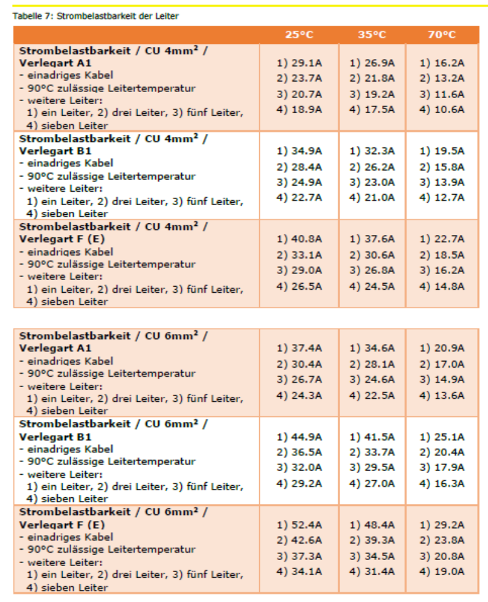

 A1: Aderleitung im 
Elektroinstallationsrohr in einer 
wärmegedämmten Wand

B1: Aderleitung im 
Elektroinstallationsrohr auf einer 
Holzwand

F: Aderleitung frei in 
der Luft

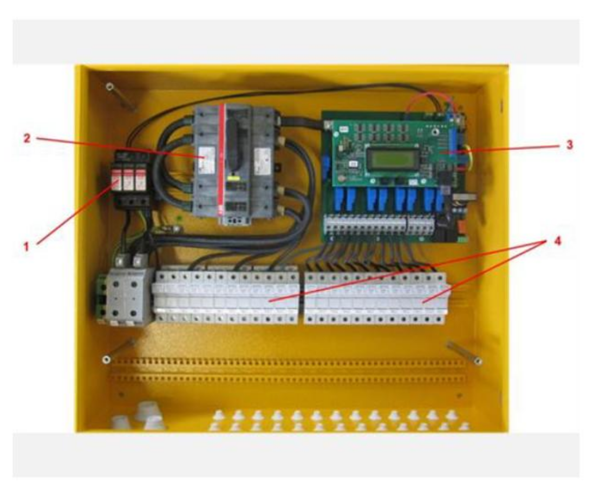
1. Überspannungschutz
2. DC-Hauptschalter
3. Strangüberwachung
4. Strangsicherung / Stangdioden

#### Insel PV-Anlage
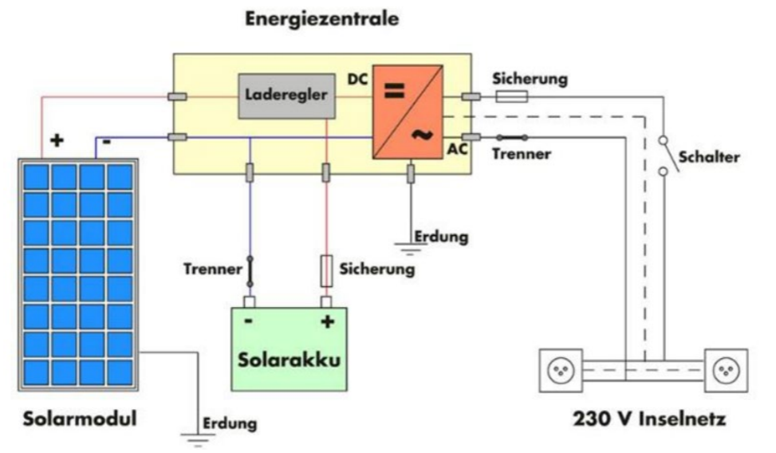

#### Netzgekoppelte PV-Anlage

# Optimierung und Monitoring
- Verbrauchsverhalten der Produktion anpassen
- Lasten intelligent schalten und der Produktion anpassen
- Energie speichern (Batterie, Uni-/Bidirektionales Laden)
- Mehrere Verbrauchsparteien an Produktion teilhaben lassen: ZEV, vZEV, LEG
#### Komponenenten
- Lastmanagement (z.B. SolarLog, Loxone, solarmanager, SMA, Fronius Ohm Pilot, etc.)
- Energiemessung am Übergabepunkt

# Batteriespeicher

- Energiemenge und Energiedichte
- Leistungsabgabe
- State of Charge (SOC)
- Batteriemanagementsystem (BMS)
- Eigenverbrauchsoptimierung
- meist Lithium-Ionen-Akkus

#### NMC (LiNiMnCoO2 / Lithium-Nickel-Mangan-Cobalt-Oxid)

- 150-220 Wh/kg
- E-Mobilität
- Weniger stabil, Gefahr von Thermal Runaway
- Kobalt ist teuer und problematisch in der Beschaffung (oft aus dem Kongo, ethisch bedenklich)

#### LFP (Lithium-Eisenphosphat / LiFePO4)
- 90-120 Wh/kg 
- Huawei, Sonnen, BYOD
- Sehr stabil, schwer entflammbar
- Günstiger (Eisen und Phosphat sind billig & verfügbar)
- Umweltfreundlicher, ohne kritische Rohstoffe

### Ablauf PV Anlage Bewilligung

a) Baugesuch / Bauanzeige

1. TAG (Technisches Anschluss Gesuch) | Jeder
2. IA (Installationsanzeige) | Vor Fertigstellung | NIV 7 oder NIV 9
3. Apparatebestellung | Kunde ohne Smartmeter | Vor Baustart
4. MPP (Mess und Prüfprotokoll) nach Abschluss der Installation | für SiNa
5. SiNa Sicherheitsnachweis | nach Abschluss der Installation | periodisch | Aenderung der Anlage
5. Externe Abnamekontrolle Beglaubigung MPP und SiNa
6. Pronovo Herkunftsnachweis und EIV (Einmavergütung) Beantragen

# Drehstrom

### Sternschaltung

$I = I_p$

$U = \sqrt3 * U_p$ = 400V

$U_p$ = 230 V

[Wikipedia Sternschaltung](https://de.wikipedia.org/wiki/Sternschaltung)

### Dreickschaltung

$U = U_p$

$I = \sqrt3 * I_p$

[Wikipedia Dreieckschaltung](https://de.wikipedia.org/wiki/Dreieckschaltung)

# Dach

### Dachformen

- Satteldach
- Pultdach
- Walmdach
- Krüppelwalmdach
- Mansardendach
- Zeltdach
- Kegeldach
- Zwiebeldach
- Sheddach
- Flachdach
- Kuppeldach
- Tonnendach

Gaube, Traufe, First, Ort, Grat

PV-Planung Dach:
- Dachaufnahme vor Ort
- Alter – Zustand – Erwartete Lebensdauer
- Schichtaufbau abklären
- Unterdach, Nageldichtband, Sondierung
- Statik prüfen

Schneefang,  
Obligatorisch wenn der Darunterliegende Bereich öffentlich zugägnglich ist.

### 1. Dacheindeckung / Dachlattung
UV-beständig, nichtbrennbar, dicht gegen frei abfliessendes Wasser
- Ziegel,
oft in ZH Breite: 215 mm Länge 320 - 378 cm [Steildach Massbuch](zz_techn_brochuere_Dach_Steildach-Massbuch_DE.pdf)
- Eternit, Achtung bis 1992 wurde Abest verbaut
- Blech: Doppelfalzblechdach, Leisten-Blechdach, Trapez-Blechdach, Sandwich-Blechdach, Kalzip-Blechdach
- Solar

### 2. Konterlattung / Dürchlüftungsraum

Minimaler Durchlüftungsraum zwischen Unterdach und Deckung (Norm SIA 232/1)

- Eine örtlich begrenzte Reduktion der Höhe oder Breite ist bis max. 50% des erforderlichen
Querschnitts zulässig.
- Wird eine dachintegrierte PV-Anlage geplant, soll die Konterlattenhöhe mind. 60mm betragen
oder eine «Stufe» höher als in der Tabelle aufgeführt.
-Lüftungsgitter reduzieren den Lüftungsquerschnitt um bis 50%

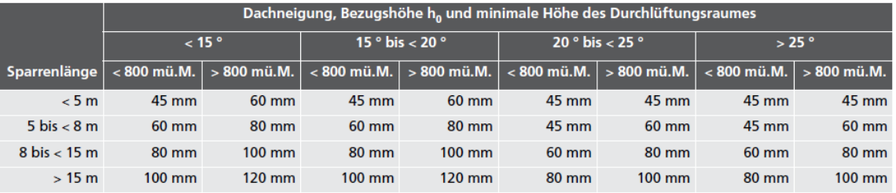

- Die Befestigung der Konterlatte muss
bei Folienunterdächern zwingend durch
Nagelbänder (links) oder
Nageldichtungen (rechts) abgedichtet
werden
- Konterlatten dienen als Montageebene
für die Lattung des Deckmaterials
- Bildet die Durchlüftungsebene zwischen
Unterdach und Deckmaterial
- Bei undichten Dächern kann
eintretendes Wasser abfliessen
- Ermöglicht einen Luftstrom und trocknet
angefallene Feuchtigkeit (z.B. durch
Spritzwasser, Schmelzwasser oder
Kondensat) wieder aus
- Die Hinterlüftung verbessert den
sommerlichen Wärmeschutz

Einschraubtiefe 8 x Durchmesser

### 3. Unterdach

Angaben der Hersteller beachten

- Schutz vor Witterung während der Bauphase «3 Monate frei bewitterbar»
- Schutz bei eindringendem Wasser
  - Defektes Deckmaterial
  - Rückschwellwasser
  - Tiefe Dachneigung
- Regenwasserdicht & Diffusionsoffen
- Bei wärmegedämmten sowie bewohnten Dächern ist ein Unterdach Pflicht SIA 232

#### Unterdach für «normale Beanspruchung» 20°
- Diese Unterdächer müssen dicht sein gegen frei
abfliessendes Meteorwasser
- In der Regel mit flachen Platten (oder Unterdachfolien die
nur überlappt sind) ausgeführt
- Z.B. Faserzementplatten, Holzfaserplatten, Holz-
Weichfaserplatten
- Die horizontalen und vertikalen Fugen sind «nur»
Überlappend ausgeführt
- Nageldichtungen werden empfohlen
- Dachdurchbrüche werden mit systemzugehörigen
Anschlussbändern ausgeführt

#### Unterdach für «erhöhte Beanspruchung» 18°
- Diese Unterdächer müssen bei Stauwasser bis 50 mm
wasserdicht sein
- Mögliche Ausführungsvarianten sind:
- Unterdachfolie, Überlappungen werden mit
Kautschuckbändern oder Leim verklebt oder mit
systemzugehörigen Klebebändern überklebt
- Holzweichfaserplatten, Stossfugen geleimt
- Nagelbänder oder Nageldichtungen sind bei Folienunterdächer
zwingend vorgeschrieben (Abdichtung von Durchdringungen
durch Befestigungsmaterial)
- Dachdurchdringungen jeglicher Art (z.B. Leitungen) müssen
mit systemzugehörigen Komponenten so abgedichtet werden,
dass die Qualität des Unterdaches (Stauwasser bis 50 mm)
gewährleistet ist. (Unterdachanschlüsse müssen min. 50 mm
aufgebordet werden)

#### Unterdach für «ausserordentliche Beanspruchung» 15°
- Diese Unterdächer müssen bei Wasserstau über 50 mm
und einem zu erwartenden Wasserdruck, dicht sein. 50mm
über Deckmaterial
- Mögliche Ausführungsvarianten sind:
- Unterdachfolien werden bei Überlappungen
thermisch (mit Heissluft) verschweisst oder
Chemisch (mit Quellmittel) «Quellverschweisst» (ist
Systemabhängig).
- Nagelbänder und Nageldichtungen sind bei
Folienunterdächern zwingend vorgeschrieben
- Dachdurchdringungen jeglicher Art (z.B. Leitungen) müssen
mit systemzugehörigen Komponenten so abgedichtet
werden, dass die Qualität des Unterdaches (Stauwasser
über 50 mm und Wasserdruck) bestehen bleibt
- Unterdachanschlüsse werden mehr als 50 mm über das
Deckmaterial stauwasserdicht geführ

### 4. Wärmedämmung 
evtl auch zwischen Sparren

U Wert unter 0.2 W/m2K. Neubauten 0,17 W/m2K, 140 bis 240 mm Isolation je nach Dämmmaterial.

Lamda Wert $\lambda$ [W/m K]

- Mineralfaserstoffe wie Steinwolle oder Glaswolle (Foto)
- Holzfaserdämmung
- Polyurethanplatten (Unterdach-Elemente und Platten)
- Zellulose

### 5. Dampfbremse

Die Dampfbremse wird warmseitig (raumseitig) der
Wärmedämmung verlegt
- Sie dient als Luftdichtung bei einem Gebäude
- Sie verhindert, dass Raumfeuchtigkeit in die
Wärmedämmung gelangt
- Leckagen, müssen unbedingt verhindert werden
- Durchdurchdringungen (z.B. Solarleitung) müssen
zwingend luftdicht angeschlossen werden
- Leckagen und unsachgemässe Durchdringungen
führen an solchen Stellen zu dauerhaften
Kondenswasserschäden in der Konstruktion

SD-Wert (Wasserdampf-diffusionsäquivalente Luftschichtdicke) in Meter

Wie verhindert man Kondenswasserbildung bei
Durchdringungen von Dampfbremsen?
1. Rohr an Dampfbremse anschliessen (abkleben)
2. Wärmedämmung muss satt am Rohr anliegen,
keine Lufträume stehen lassen (kalt & warm trennen)
3. Unterdach sauber anschliessen (abdichten)
4. Keine Hohlräume im Rohr / Ausdämmen
Feuchtigkeitswanderung verhindern

### 6. Holzschalung

### 7. Sparren
Flumserdach und Walliserdach haben Sparren unten an der Dämmung. Flumserdach hat 30° Schrauben von der Konterlattung zum Sparren. Walliserdach hat 90° Schrauben mit Latten in der äusseren Dämmung.

## Geometrie Dachschräge

$l_{Dach}=l_{plan} / cos(\Theta)$

$l_{plan}=l_{Dach} * cos(\Theta)$

$l_{plan}$ ist das Mass vom Grundriss

$\Theta$ ist die Dachschräge

$l_{Dach}$ ist die effektive Länge des Daches

[Wikipedia Trigonometrische Funktion ](https://de.wikipedia.org/wiki/Trigonometrische_Funktion)

## Flachdach

Dachhaut muss unbedingt geschützt werden.
zBsp mit Schutzfilz.
Begrünte Dächer erhöhen Retention, dafür erhöter Wartungaufwand der PV, PV auftsänderung muss min 50 cm hoch sein. Keins substrat wenn möglich unter der PV Anlage besser Kies.

#### Varianten 
Umkehrdach, Verbunddach, Duodach, Plusdach, Kaltdach (Dach mit Durchlüftungsschicht), Doppeldach

1.5 % Gefälle min zur Entwässerung

von Oben nach unten, Bsp: Kies, Abdichtung, Isolation, Dampfbremse, Betton

#### Abdichtungen
Elastomerbitumen (PYE), Thermpoplatische Polyolefine (TPO), PVC, Ethylen-Propylen-Dien-Kautschuk (EPDM), Flüssigkunststoff

## Fasade

Konsolen mit 45° - 75° Neigung verbessern den Wirkungsgrad zu 90° Montage. Nur bei Ueberdachungsfunktion.

## Befestigung

- Klemmsystem einfach oder Kreuschienen Verbund, Viertelklemmung
- Einlegesystem
- Indach System, geschuppt überlappend, in Rinne entwässernd oder mit Abschlussblech. Auf Lüftung achten.

### Ausdehnung

- Aluminuiun 2,4 mm/(m*100K)
- Stahl 1,2 mm/(m*100K)
- Kupfer 1,7 mm/(m*100K)
- Glas 0.5 mm/(m*100K)
- Glasfaserverstärkter Kunststoff GFK 5 bis 15 mm/(m*100K)

## Durchdringungen

Elektrorohre müssen dicht sein damit keine Konvenktion und Kondensation stattfindet.

## Sicherheit

### ABS Arbeitssicherheit

Kollektivschutz (Geländer) vor persönlichem Schutz

Absturzsicherung ab 2 m zur Dachkante, ab 2 m Höhe Gerüst ab 2 Manntage

Arbeiten < 2 Manntage draussen bis 3m Leiter dann Absturzsicherung PSAgA Persönlicher Schutz gegen Absturz oder Gerüst.

### Schneefang

Gebäudeeigentümer haftet

## Kennzeichnung für Feuerwehr bei der HW

# Fläche

## Dreieck

$A = (l * h )/2$

## Kreis

$A = (d²*\pi)/ 4 = r2 * \pi$

$r = \sqrt{A/\pi}$

$d = 2*r$

# Heizleistung und Wärmeübertragung

Heizleistung [W] $P = \frac{Q}{t}$

## Heizleistung bei Massefluss

1 [J] = 1 [Ws]
1 [MJ] = 1 * 10 ^6 J 
kWh = MJ / 3.6

Wärmeenergie $Q [J][Ws] = m \cdot c \cdot \Delta t$

- $m$: Masse des Mediums [Kilogramm (kg)]
- $c$: Spezifische Wärmekapazität des Mediums [J/(kg·K)] (z. B. Wasser: $c$ approx 4.18, [kJ/(kg·K)]
- $\Delta t$: Temperaturänderung [K]

Wärmeleistung $P [W] = \frac{Q}{t} = \frac{m \cdot c \cdot \Delta t}{t}$

- $t$: Zeit [s]

### Rohrmasse und Max. Durchfluss

| Gewinderohr (") | Nennweite (DN) | Außendurchmesser (mm) | Max. Durchfluss (l/s) |
| --------------- | -------------- | --------------------- | --------------------- |
| 3/8"            | DN 10          | 17,2                  | 0,33                  |
| 1/2"            | DN 15          | 21,3                  | 0,83                  |
| 3/4"            | DN 20          | 26,9                  | 1,33                  |
| 1"              | DN 25          | 33,7                  | 2,50                  |
| 1 1/4"          | DN 32          | 42,4                  | 3,83                  |
| 1 1/2"          | DN 40          | 48,3                  | 5,00                  |
| 2"              | DN 50          | 60,3                  | 8,33                  |
| 2 1/2"          | DN 65          | 76,1                  | 13,33                 |

## Heizleistung bei Wärmeübertragung durch eine Fläche

Wenn Wärme durch eine Fläche (z. B. durch eine Wand) übertragen wird, lautet die Formel:

Wärmeleistung [W] $P = A \cdot k \cdot \Delta t$

- $A$: Fläche der Wärmeübertragung [m²]
- $k$: Wärmedurchgangskoeffizient [W/(m²·K)] (Materialabhängig)
- $\Delta t$: Temperaturdifferenz zwischen den beiden Seiten der Fläche [K]

Wärmedunrchgangskoeffizient [W/(m²·K)] $k = 1 / (1 / \alpha_i + \sum{d / \lambda} + 1 / \alpha_i)$

## Wärmepumpenleistung

Heizleistung $P_{heiz} [kW] = P_{el} * E_{WP}$

$P_{el} = P_{heiz} / E_{WP}$

$E_{WP}$ = Leistungszahl

Erdsonde ca 90 Watt / m Sondenlänge

## Stromverbrauch der Wärmepumpe

Die elektrische Energie $E_{{el}}$, die von der Wärmepumpe verbraucht wird, hängt von der Effizienz der Wärmepumpe ab. Diese Effizienz wird durch die **Jahresarbeitszahl (JAZ)** beschrieben:

$$
E_{{el}} = \frac{Q_{{Heiz}}}{{JAZ}} \cdot t
$$

- $E_{{el}}$: Elektrischer Energieverbrauch der Wärmepumpe [kWh]
- $Q_{{Heiz}}$: Heizleistung der Wärmepumpe [kW]
- ${JAZ}$: Jahresarbeitszahl (dimensionslos), beschreibt das Verhältnis von erzeugter Wärmeenergie zu eingesetzter elektrischer Energie.
- $t$: Zeit, in der die Wärmepumpe läuft [h].

Ermittlung der Heizleistung aus dem Energie-
verbrauch von Öl- oder Gaskessel
Die erforderliche Heizleistung kann 
aufgrund des jährlichen Brennstoffverbrauchs Die Berechnungen basieren auf 20 °C Raumlufttemperatur bis 100 kW. Für grössere
Leistungen sollte nach Kap. 3.2 vorgegangen werden Dimensionierung
von Wärmepumpen Bundesamt für Energie https://pubdb.bfe.admin.ch/de/publication/download/165.

### Mittelland

- Mit Warmwasser Warmwasserbereitung ganzjährig Kessel
  
  $Q_H$ = Verbrauch / 300

- Ohne Warmwasser Warmwasserbereitung ganzjährig elektrisch
  
  $Q_H$ = Verbrauch / 265

### Über 800 m ü.M.

- Mit Warmwasser Warmwasserbereitung ganzjährig Kessel
  
  $Q_H$ = Verbrauch / 330

- Ohne Warmwasser Warmwasserbereitung ganzjährig elektrisch
  
  $Q_H$ = Verbrauch / 295

$Q_H$ = erforderlicher Heizleistungsbedarf bei Auslegetemperatur [kW]

Verbrauch in Liter Öl 

- 1 kg Öl entspricht ca. 1.19 Liter
- 1 Betriebs-m3 Gas entspricht ca. 0.93 Liter Öl

Zur Kontrolle der Resultate kann die spezifische Heizlei stung herangezogen werden. Sie errechnet sich aus der Heizleistung dividiert durch die Energiebezugsfläche (beheizte Bruttogeschossfläche):

| Gebäudetyp                              | W/m2      |
| --------------------------------------- | --------- |
| Herkömmlich wärmegedämmte Wohnhäuser    | 50 ... 70 |
| Gut wärmegedämmte bestehende Wohnhäuser | 40 ... 50 |
| Neubauten gemäss heutigen Vorschriften  | 30 ... 40 |
| Herkömmliche Dienstleistungsbauten      | 60 ... 80 |

brauche auch https://biber.solar/heat-pump-calculator/

---

## Heizleistung von Fosilen Heizungen

Heizenergie [MJ] $Q_F = m * H_s$

Heizleistung [kWh] $P = Q / t = m * H_s / t$

Masse $m$ [kg]

Heizwert $H_s$ [MJ/kg] oder [kWh/kg]

- Oel Extraleicht: 42,9 [MJ/kg]
- Erdgas:  37 [MJ/m³] / 10,305 [kWh/m³]

kWh = MJ / 3.6

$m = Q / H_s$

Anpassung Heizwert https://pubdb.bfe.admin.ch/de/publication/download/7442

Werte Gas: https://www.svgw.ch/media/9858/g10001_d_werte2022.pdf

### Umrechnung auf benötigte Leistung mit WP

$Q_{WPel}=Q_{WP}*\eta$ 

$Q_{WP}$= Benötige Wäremeleistung (EW Sperrfrist beachten)

$Q_{WPel}$= Elektrische Aufnameleistung

$\eta$= Wirkungsgrad 

### Berechnung des jährlichen Energiebedarfs für Heizung

Energiebedarf (kWh) = (Heizlast / 28) * 16 * HGT Dabei gilt:

- Heizlast: Die benötigte Wärmeleistung des Hauses in kW
- 28: Differenz zwischen -8°C (Auslegungstemperatur) und 20°C (gewünschte - Raumtemperatur)
- 16: Angenommene tägliche Betriebsdauer der Heizung in Stunden
- HGT: Heizgradtage des Standorts
- [Heizgradtage HGT Schweiz](https://opendata.swiss/de/dataset/monatliche-heizgradtage-in-der-schweiz-gewichtet/resource/fc492ffc-1eb6-4919-af54-16998eaf7eaa)
  - [Heizgradtage HGT Ortschaften](https://www.hev-schweiz.ch/vermieten/nebenkostenabrechnungen/heizgradtage)
- [Heizgradtage HGT St. Gallen](https://opendata.swiss/de/dataset/heizgradtage-st-galler-stadtwerke/resource/da5ab61c-1b50-4d1f-83b5-f429723e60b8)

### Ermittlung der Heizlast für Neubauten:

Heizlast (kW) = beheizte Fläche (m²) * Heizlast pro m²

Energiebedarf (kWh) = (Heizlast / 28) * 16 * HGT

- plus ca. 250 W pro Person für den Warmwasserbedarf5

Für ein 140 m² Einfamilienhaus in Zürich mit 4 Personen:

      Heizlast: 140 m² * 35 W/m² = 4.9 kW
      HGT für Zürich: 32672
      Warmwasserbedarf: 4 * 250 W = 1 kW
      Energiebedarf = ((4.9 + 1) / 28) * 16 * 3267 ≈ 11,900 kWh pro Jahr

## Wärmepumpen Regelung

Fast alle Wärmepumpen tragen ein Label namens "SG Ready", weil das eine Förderbedingung ist in Deutschalnd. 
SG Ready ist ein simples binäres Zweidraht-Zustandssystem, das folglich 4 Zustände abdeckt: 0:0, 0:1, 1:0 und 1:1. Die Betriebszustände sehen so aus:

1. Nicht heizen, Sperrung, wie sie z. B. für die Sperrzeiten in Heiztarifen gebraucht wird

2. Normalbetrieb mit einer Leistung, die Wärme auch für eventuelle Sperrzeiten produziert

3. Erhöhter Normalbetrieb nach vorher hinterlegten Parametern als "Einschaltempfehlung". Die WP-Steuerung kann dennoch entscheiden, dass jetzt nicht eingeschaltet wird.

4. Anlaufbefehl mit vorher hinterlegten Parametern für Leistung, z. B. für höhere Vorlauftemperaturen

Bei der Verwendung der Einschaltempfehlung mit erhöhten Temperaturkurven. Diese Variante hat gegenüber dem Anschaltzwang den Vorteil, dass die Wärmepumpensteuerung das letzte Wort hat und bei überlaufenden Wärmespeichern und geschätzter Nutzlosigkeit des Laufes trotzdem nicht einschaltet. Sie hat den Nachteil, dass sie keinen größeren Plan berücksichtigen kann, zum Beispiel mit Prognosedaten. 

# Abkürzungen und Namen

AC Wechselstrom 

DC Gleichstrom

Diode 

EnFV Energieförderverordnung

EnG Energiegesetz

EnV Energieverordnung

EVU Energieversorgungsunternehmen

GAK Generator Anschluss Kasten Im Generatoranschlusskasten werden die Stränge der Solarmodule an String-Sammelklemmen zusammengeführt, Überspannungsableiter

GREIV Einmalvergütung für grosse Anlagen. Betreiber von Anlagen mit einer 
Leistung von mehr als 100 kW können ab 2018 zwischen EVS und GREIV 
wählen.

HV Hauptverteilung

IEC International Electrotechnical Commission 

KLEIV Einmalvergütung für kleine Anlagen. Betreiber von Anlagen mit einer 
Leistung von weniger als 100 kW erhalten ab 2018 ausschliesslich die 
KLEIV.

MPP-Tracker Maximal-Leistungspunkt-Suche

NIN Niederspannungs-Installations-Norm

Pronovo Unterem anderem zuständig für die Ausstellung von Herkunftsnachweisen 
und Abwicklung der Förderprogramme des Bundes für die Stromproduktion 
aus neuen erneuerbaren Energien.

PV Photovoltaik

RE Rundsteuerempfänger

SENS Die Stiftung SENS (Sustainability, Expertise, Network, Solution) ist eine 
unabhängige, neutrale und nicht gewinnorientierte, gemeinnützige Stiftung 
und tritt gegen aussen mit der Marke SENS eRecycling auf.

STC Standart Test Conditions  (25°C, 1000 W/m2, 1,5 AM Atmosphärendick / Spektrum) Testkondition für Modulmessungung

SIA Schweizerischer Ingenieur- und Architektenverein

UV Unterverteilung

Üu Überstrom Unterbrecher

ÜA Überspannungsableiter 

VKF Vereinigung Kantonaler Feuerversicherungen

VNB Verteilnetzbetreiber

NIV-14 Niederspannungs-Installationsordnung Artikel 14 erlaubt die Installation spezifischen elektrischen Anlagen inbesondere Photovoltaik anlagen und andere wie USV-Anlagen etc. DC-Stecker pressen die Grenze ist der AC Schalter zum vom WR Verteiler.

NA-Schutz Netz und Anlageschutz schaltet die Anlage ab, wenn die Spannung im Netz oder die Frequenz nicht mehr stimmt

NIV Art.7 Bewilligung für natürliche Personen

NIV Art.9 Bewilligung für Betriebe

NA-Schutz Netz und Anlageschutz schaltet die Anlage ab, wenn die Spannung im Netz oder die Frequenz nicht mehr stimmt

NOCT Normal Operating Cell Temperature (20°C, 1 m/s Wind, 800 W/m2, 1,5 AM Atmosphärendick / Spektrum) Testkondition für Modulmessungung

ESTI Eidgenössisches Starkstrominspektorat nimmt unter anderem die NIV-14 Prüfung ab

Hans Carl von Carlowitz Begründer dern Nachhaltigkeit

Gro Harlem Bruntland moderne Definition der Nachhaltigkeit.

HAK Hausanschlusskasten

ZEV Zusammenschluss zum Eigenverbrauch hinter dem HAK, es müssen eigene Zähler eingebautt werden. Zähler müssen geicht sein. zevvi.ch. Müssen Messmittel für elektrische Energie und Leistung (EMmV) entsprechen. Zähler müssen von Metas abgenommen werden.

METAS Eidgenössischen Institut für Metrologie Die Eichgültigkeitsdauer für elektronische Elektrizitätszähler beträgt zehn Jahre, für elektromechanische Zähler fünfzehn Jahre. Nach Ablauf dieser Fristen ist eine Nacheichung durch eine vom Eidgenössischen Institut für Metrologie (METAS) ermächtigte Eichstelle erforderlich. 

TAG Technisches Anschlussgesuch bei Änderung grösser als 3,7 kW

vZEV Virtueller Zusammenschluss zum Eigenverbrauch in der selben Netzebene 7 ab 2016

EVG Eigenverbrauchsgemeinschaft, Die EVG besteht aus Eigentümer/Betreiber der Solaranlage und mehreren Endverbrauchern. EW kann Zählers stellen bzw einen zusätzlichen für die PV Anlage anbieten. EW Infrastruktur wird genutzt.

LEG lokale Elektrizitätsgemeinschaft können sich Solarstrom-Produzentinnen, Speicher-Betreiber sowie Endverbraucherinnen und Endverbraucher innerhalb des gleichen Gemeindegebiets zusammenschliessen und so lokal produzierten Strom lokal verbrauchen. Am 9. Juni 2024 hat das Schweizer Stimmvolk dem revidierten Stromversorgungsgesetz zugestimmt. Somit wird es künftig möglich sein, lokal erzeugte Elektrizität über das öffentliche Netz innerhalb eines Quartiers oder einer Gemeinde zu vermarkten. gemeindeleg.ch / leg-register.ch

- Örtliche Nähe: Die Teilnehmenden (Solarstrom-Produzenten, Speicher-Betreiberinnen und Endverbraucher) müssen sich im gleichen Netzgebiet, auf der gleichen Netzebene und im gleichen Gemeindegebiet befinden.
- Definierte Mindestleistung: Solaranlagen in der LEG müssen eine Mindestleistung von 20 Prozent* im Verhältnis zur Anschlussleistung aller LEG-Endverbraucherinnen und Endverbraucher aufweisen.
- Geeignete Messausstattung: Alle Teilnehmenden müssen mit einem kommunikativen, digitalen Stromzähler (Smart Meter) ausgestattet sein.

Pixpro solarmarkt

# Energie Formen und Quellen

Es gilt die Energieerhaltung.

Energieformen:

- Chemisch
- Kinetisch
- Elektrisch
- Thermisch
- Strahlungsenergie
- Lageenergie
- Rotation
- Kernenergie
- Photosynthese

Bsp: Kohlekraftwerk: Chemisch -> Thermisch -> Kinetisch -> Elektrisch

Primärenergie 100%: Unverarbeitete Rohstoffe, wie Kohle, Erdöl, Baum

Sekundärenergie: Verarbeitetes Material, wie Diesel, Pellets, Strom

Endenergie: Energie beim Vebraucher, wie Strom, Pellets vor der Haustüre, Diesel im Tank

Nutzenergie: Energie die genutz wird, Wärme eines Föhnes, Energie mit der der Computer betrieben wird

Verfügbarkeit:

| Recource | Reserven         | Dauer          |
| -------- | ---------------- | -------------- |
| Erdöl    | 230 GT           |                |
| Kohle    | 230 GT           |                |
| Erdgas   | 188 Billionen m3 | 3 Billionen m3 |
| Uran     | 1,8 Mt           | 14 Mt          |

## Vorteile / Nachteile Erneuerbare Energien

### Photovoltaik

| Vorteile                    | Nachteile               |
| --------------------------- | ----------------------- |
| Einfache Installation       | Produktion nur tagsüber |
| Kostengünstig 0.13 CHF / WP | Wirkungsgrad gering     |
| Betrieb Emmisionsfrei       | Abhängigkeit von China  |

### Solarthermie

| Vorteile                                                           | Nachteile                        |
| ------------------------------------------------------------------ | -------------------------------- |
| Wirkungsgrad höher als PV (~60 % Kollektorwirkungsgrad bei dT=40K) | Schwierigere Installation als PV |
| Gut Speicherbar                                                    | Nur Wärme                        |

### Windkraft

| Vorteile                                         | Nachteile                                                        |
| ------------------------------------------------ | ---------------------------------------------------------------- |
| Produziert auch nachts, wenn PV nicht produziert | Gesellschaftliche Akzeptanz geringer als bei PV und Solarthermie |
| Hohe Leistung                                    | Beeinträchtigung Landschaftsbild                                 |

### Wasserkraft

| Vorteile                                                            | Nachteile                        |
| ------------------------------------------------------------------- | -------------------------------- |
| Schwarzstartfähig (d.h. kann Netz nach Black Out wieder hochfahren) | Grösserer Eingriff ins Ökosystem |
| Langzeitspeicherung von Energie möglich                             | Geringe Energiedichte            |
| Steuerbar                                                           |                                  |
| Immer Verfügbar                                                     |                                  |

### Biomasse

| Vorteile                          | Nachteile                            |
| --------------------------------- | ------------------------------------ |
| Verwertung Bioabfälle             | Hohe Investitionen                   |
| Vielseitig nutzbar (Strom, Wärme) | Komplexe Technik                     |
| Speicherbar => Grundlastfähig     | Anlage muss dicht sein, sonst können |
| Klimagase entweichen              |                                      |

## Sonnenenergie

E = m * c2

c = 2.998e+8 m/s

m = differenz Masse Helium Wasserstoff

Energie kann aus Umwandlung von Masse kommen nur in der Sonne wenn Wasserstoff in Helium umgewandelt werden

15.8 MW/m2 Sonnen Abstrahlung

Abstand 150 Mio km

1367 W/m2 erreichen die Erde

1000 W/m2 gem STC

Auf dem boden gem SolarGIS am Wendekreis

mal wirkungsgrad der PV Anlage

## Treibhauseffekt

Wir sind bei 427 ppm in 2024, 
vor der Industrialisierung war es ca 280 ppm, anstieg von über 50 % ca 147 ppm.

Die Globale Durschnitstemperatur 2025 hat sich um 1,2 bis 1,3 °C erhöht zum vorindustriellen Niveau.

2024 Gabe es einzelne Monate die 1,5 °C über dem vorindustriellen Niveau lagen.

Aktuell ist die Schweiz 2.8 °C über dem 
vorindustriellen Zeitalter

Treibhausgasemissionen Schweiz Inland und 
Importe: 13 t / Kopf

2022 sind Treibhausgasemissionen gegenüber 
1990 in CH um 24% gesunken

Natürlicher Treibhauseffekt: +33°K Durchschnitstemperatur ohne -18°C mit 15°C

#### Anteile der CO2 Emissionen in der Schweiz

- 21% Landwirtschaft, Abfallbehandlung, Ausstoss synthetischer Gase
- 23% Gebäude
- 23% Industrie
- 33% Verkehr (ohne int. Flüge)

### Konsequenzen

- Extremwetterereignisse nehmen zu
- Meeresspiegel steigt
- Ökosystem kann sich nicht mehr schnell genug anpassen => 
  Artensterben
- Gesundheitsrisiken 
- Die Auswirkungen machen sich besonders in Entwicklungs- und 
  Schwellenländern bemerkbar => mehr Migration

### Kipppunkte

- An einem Kipppunkt fällt ein System von einem Zustand irreversibel in 
  einen anderen
- Wird ein Kipppunkt erreicht, lässt sich dieser auf sehr lange Zeit nicht 
  mehr rückgängig machen, auch wenn die Emissionen reduziert werden
- Einige Kipppunkte beschleunigen die CO2 Emissionen und damit den 
  Klimawandel („positive Rückkopplung“ = Ein Effekt verstärkt seine 
  eigene Ursache) 
- Arktischer Eisschild reflektiert viel Sonnenlicht direkt zurück ins All => 
  Verkleinerung des Eisschildes bedeutet weniger Reflektion
- Permafrostboden könnte auftauen und gigantische Mengen 
  gebundenes CO2
  freisetzen

### Pariser Klimaziele

- Vereinbart 2015 auf der Weltklimakonferenz in Paris 
- Die Erderwärmung soll auf deutlich unter 2.0 °C, besser 1.5°
  gegenüber dem Vorindustriellen Zeitalter begrenzt werden (aktuell 
  bereits bei 1.1° im globalen Durchschnitt, 1.6° auf dem Festland1))
- Ärmere Länder sollen finanziell unterstützt werden 
- Es gibt keine Strafen für Zielverfehlungen…

## Energiestrategie 2050

- 2007 wurden vier Säulen festgelegt:
- - Energieeffizienz verbessern und Energie sparen
- - Ausbau Erneuerbare Energien
- - Sanierung und Neubau von Grosskraftwerken (inkl. Kernkraft)
- Energieaussenpolitik 
- Ziele: bis 2050 die Treibhausgasemissionen auf Netto-Null senken (Netto-Null = Emissionen maximal so hoch, wie die natürlichen und technischen 
  Aufnahmekapazitäten der Schweiz) 
- Ziel für 2050 Netto-Null, für 2030 halbieren 
  gegenüber 1990
- Planetare Belastbarkeitsgrenze: 0,6 t / Kopf
- Atomausstieg

### Massnahmen

- Liberalisierung Strommarkt (Stromversorgungsgesetz)
  21.02.2025 
- Seit 2018 Netzzuschlag von 2.3 Rp. für Netzzuschlagfonds für 
  Energieeffizienzmassnahmen
- Gebäudeprogramm, finanziert u.a. durch CO2 Abgabe 
- Gebäudesanierung kann steuerlich geltend gemacht werden
- Emissionsobergrenzen für Verkehr (Reduktion von 130 g CO2/km auf 95 g CO2/km)
- Wettbewerbliche Ausschreibungen (Förderung von besonders sparsamen 
  Massnahmen)
- Investitionsbeiträge für PV (pronovo) und Wasserkraft > 10 MW 
- Nationales Interesse (Gerichtsentscheide bei Konflikt EE vs. Naturschutz)
- Kürzere Bewilligungsverfahren (für EE Anlagen und Netzausbau)
- Keine neuen AKWs

### Co2 Gesetz Schweiz

Ziele:

- CO2 Ausstoss bis 2030 halbieren gegenüber 1990 (ca. 800.000 TJ)
- ¾ der Massnahmen zur CO2 Reduktion im Inland

Steuerwerkzeuge:

- Abgabe auf jede Tonne CO2
- Anpassung der Abgabe je nach erreichter Verminderung
- Einnahmen gehen zu 1/3 an Bevölkerung via Krankenkasse, 1/3 an 
  Wirtschaft und AHV, 1/3 an Gebäudeprogamm

### [Energiegesetz 9.6.2024](https://www.fedlex.admin.ch/eli/fga/2023/2301/de)

[Energieproduktion EE ohne Wasserkraft 2022 ca. 7.7 TWh](
https://de.statista.com/statistik/daten/studie/329694/umfrage/stromerzeugung-in-der-schweiz-nach-energietraeger/)
Vorgaben im Gesetz: 

- 2035 mind 35 TWh
- 2050 mind 45 TWh
- bei 300 m2 Gebäudefläche ist eine Solaranlage Plicht

Lokale Eletrizitätsgemeinschaften LEG um Energie innerhalb dieser Gemienschaft abzusetzen Voraussetzungen sind:

- im gleichen Netzgebiet
- gleiche Netzebene
- örtliche nahe beieinander am Netz angeschlossen sind
- gemeinsame ein Mindestmasse and Erzeugern zu den Verbrauchern aufweisen

Verbrauchsziele: der Verbrauch ist pro Person und Jahr 2000 bis 2035 um 43% und bis 2050 um 53 % zu senken.

# Übersicht Vorschriften, Normen, Standards

- Vorschriften sind einzuhalten: z.B. Energiegesetz, kantonale Vorschriften
- Verordnungen sind einzhualten: z.B. NIV (Niederspannungs-Installations-Verordnung) mit Art. 14
- Normen sind Handlungsempfehlungen: ISO (International), SIA (Ingenieur- und 
  Architektenvereins), ElectroSuisse z.B. NIN 
  (Niederspannungs-Installations-Norm)
- Standards sind freiwillig: z.B. Minergie, GEAK 

## Vorschriften

- Energiedirektorenkonferenz (EnDK): Forum der Energiebereichsleiter 
  der einzelnen Kantone. Koordinieren Energiefragen und kantonale 
  Interessen
- Erlässt „Mustervorschriften der Kantone im Energiebereich“ (MuKE) => 
  Leitfaden für kantonale Energievorschriften
- Um was geht’s in MuKE 2014? (Skript S.59)
- Neubauten müssen angemessenen Anteil an Stromverbrauch selbst 
  produzieren
- Min. 10% der Heizenergie muss aus erneuerbaren Quellen kommen nach 
  Heizungswechsel
- Einführung GEAK 
- U-Grenzwerte für Bauteile

## Gebäudeenergieausweis der Kantone (GEAK)

- Gibt die Energieeffizienz der Gebäudehülle und den standardmässigen
  Energieverbrauch eines Gebäudes an
- Bewertungsskala von A bis G, zeigt Verbesserungspotenziale auf
- Wird von einem GEAK Experten bewertet
- Gut geeignet für Modernisierungsmassnahmen
- Schafft schweizweit eine Vergleichbarkeit
- Zusätze von GEAK plus:
- Beratungsbericht mit Beschreibung konkreter Modernisierungsmassnahmen in bis zu 
  drei Varianten
- Priorisierung der Massnahmen
- GEAK wird vom Gebäudeprogramm in SG und AR nicht gefördert, in TG 
  pauschal, AI fördert 
- [www.geak.ch](https://www.geak.ch)

## Minergie - Standard

- Freiwilliger Baustandard für Energieeffizienz
- Gültig für Neubauten und Sanierungen
- Hauptansatzpunkte sind die Gebäudehülle, Lufterneuerung und 
  geringer Energiebedarf
- Ziele:
- Verbesserung der Wohnqualität durch warme Oberflächentemperatur, 
- Werterhalt von Gebäuden, 
- geringere Heizkosten und Unabhängigkeit von Energiepreisen
- Verminderter CO2
  -Ausstoss
- Abstufungen: Minergie < Minergie-P < Minergie-A
- Finanzielle Anreize und Förderungen: Förderung - Minergie

## Gebäudeprogramm

- Energieförderportal St. Gallen: Förderportal (sg.ch)
- Kantonale Förderprogramme: https://portal.dasgebaeudeprogramm.ch/
- Gefördert werden Heizungs- und Gebäudesanierungen, PV und 
  weitere Massnahmen
- Die geförderten Massnahmen hängen von der jeweiligen 
  Gemeinde ab (z.B. St. Gallen kein PV [wird eigenständig von der 
  Stadt gefördert], dafür in Wattwil)

## Fördermassnahmen PV und Solarthermie

- Montagearten: Freistehend, Angebaut, Integriert
- Förderung auf Bundes-, Kantons- und Gemeindeebene
- Für jede Gemeinde sind ein grosser Teil der Förderprogamme
  einsehbar unter: [www.energiefranken.ch](https://www.energiefranken.ch/de) (Achtung: Gemeindeförderungen werden oft nicht aufgeführt)
- Pronovo
- Energiefonds Stadt St. Gallen
  Antrag Fördergelder: [Login | Kundenportal Pronovo](https://kundenportal.pronovo.ch/)
- Rechner Förderbeitrag: [www.pronovo.ch](https://pronovo.ch/)

# Links

https://www.geoportal.ch/

https://www.uvek-gis.admin.ch/BFE/sonnendach/

https://solargis.com/resources/free-maps-and-gis-data

